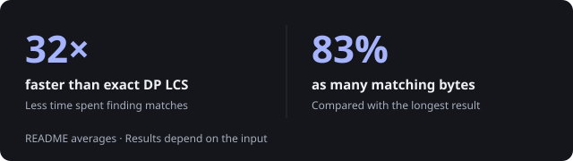

# coslcs

**Find matching bytes faster, without finding every possible match.**

Two files can share bytes in the same order, even with gaps between them. An exact longest common subsequence algorithm finds the largest such sequence. `coslcs` finds a shorter one, trading completeness for speed.

{ width="560" style="max-width: 100%; height: auto;" }

Use it when a quick, approximate alignment is enough.

[Source code](https://github.com/vantorrewannes/coslcs)

## Take the nearest match

**Closest Offset Sum** describes the rule: choose the matching byte pair with the smallest combined distance from the current positions, emit it, and move forward.

Equal leading bytes match immediately. Otherwise, a small byte lookup table replaces pairwise comparisons. The source scan stops when later candidates cannot improve the best match.

No backtracking. No heap allocations in the Zig iterator.

## What gets left behind

A nearby match can block a better result:

```text
source     z123abc
target     456abcz

coslcs     z
exact LCS  abc
```

`z` wins on immediate distance, but consumes the end of the target. The remaining letters never get a chance.

**The result is valid, not necessarily optimal.** Identical inputs take linear time, while worst-case runtime remains quadratic for equal-length inputs. The fallback table occupies 2 KiB with 64-bit indices.

<details>
<summary>About the performance figures</summary>

The chart shows averages reported in the README, not guaranteed speed or result quality. The included benchmark measures iterator speed only. It contains neither a dynamic-programming baseline nor an optimal-length comparison, so it cannot independently reproduce those figures.

</details>

## Try it

```zig
const coslcs = @import("coslcs");

var iterator = coslcs.CosLcsIterator.init("abc", "axbc");

while (iterator.nextPair()) |pair| {
    // pair.value
    // pair.source_index
    // pair.target_index
}
```

Use `next()` for bytes only and `reset()` to restart. Inputs are borrowed, not copied.

A C API is included. Its constructor allocates the iterator; iteration itself performs no heap allocations.

Requires Zig 0.16.0. MIT-licensed.

```bash
zig build test
zig build bench --release=fast
```