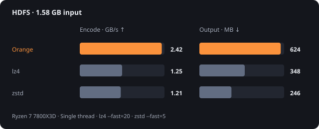
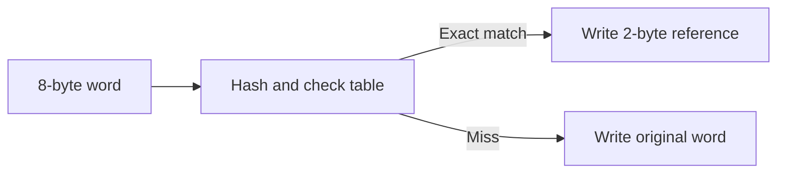

# Firetrail

**Compress faster. Accept a larger file when the time saved is worth it.**

On the HDFS log benchmark, Firetrail Orange encoded at **2.42 GB/s**, nearly twice the throughput of `lz4 --fast=20`.

The catch? Its output was larger. These two plots show the trade-off.

[Source code](https://github.com/vantorrewannes/firetrail)

## Speed versus size

Same input: a 1.58 GB HDFS log. Orange needs no external dictionary.

{ width="560" style="max-width: 100%; height: auto;" }

**Firetrail wins time here, not space.** On Wikipedia text, Orange did both: it encoded `enwik9` faster than lz4 while producing slightly smaller output.

Across all four tested corpora, Orange's geometric-mean encoding speed was **1.5× lz4** and **2.3× zstd** at these settings. lz4 decoded fastest throughout; zstd produced the smallest files.

<details>
<summary>Benchmark conditions</summary>

Single-threaded, end-to-end CLI runs on a Ryzen 7 7800X3D running CachyOS, with a warm page cache.

Baselines: lz4 1.10.0 at `--fast=20` and zstd 1.5.7 at `--fast=5`, both using `-T1`. These are fast configurations, not defaults.

Corpora: `silesia.tar`, `HDFS.log`, `enwik9`, and `enwik8`. Results are machine- and content-dependent.

White's separate README results use a dictionary trained on the input itself. Training is outside the timed run, and the dictionary is excluded from compressed size.

</details>

## Why it moves quickly

Firetrail borrows the word-dictionary approach from Density. Instead of searching for long matches, it performs one lookup per 8-byte word.



A compact header distinguishes references from raw words. Hash collisions affect compression opportunities, not correctness: the encoder checks the stored word before using a reference.

No entropy coder. No heap allocations inside the block routines. The CLI reuses buffers to stream files in 8 MiB blocks.

Three modes control what the dictionary remembers:

- **Orange:** replace entries on a miss. Adaptive and self-contained.
- **Red:** protect frequently matched entries with counters. Useful for dictionary training.
- **White:** keep the dictionary fixed. Reuse a trained table without updating it.

## Try it

Start with Orange:

```bash
firetrail orange encode input.log input.fto
firetrail orange decode input.fto restored.log
```

For White, train on representative data and use the same dictionary on both sides:

```bash
firetrail red encode sample.log /dev/null --export dict.bin
firetrail white encode app.log app.ftw --import dict.bin
firetrail white decode app.ftw restored.log --import dict.bin
```

Requires Zig 0.16.0. Build with `zig build --release=fast`. Use `-` for an input or output path to stream through standard input or output.
