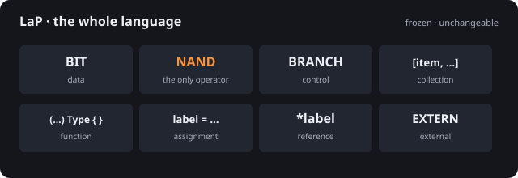
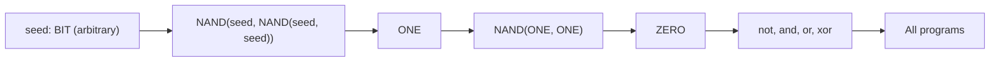

# Labels & Primitives

**Eight primitives. One operator. A spec that doesn't move.**

LaP is a tiny language with a frozen spec. A `.lap` file written today should still compile in fifty years. Only the compilers and tooling may evolve.

{ width="560" style="max-width: 100%; height: auto;" }

[Source code](https://github.com/VantorreWannes/lap/)

## Why freeze it?

Most languages grow. New versions add features, deprecate old ones, and quietly break programs that worked yesterday. LaP takes the opposite bet: keep the spec small and stop changing it.

- **Programs outlive their toolchain.** A `.lap` file from 2026 should compile on a 2076 compiler.
- **Skills transfer.** If you know LaP, you know LaP. There is no version to relearn.
- **Compilers compete, not the language.** Anyone can write a new backend, runtime, or optimizer without changing what users see.

The spec is the contract. Everything else is implementation.

## Eight primitives

The whole language:

- `BIT`: the data primitive. A single bit, starting in an arbitrary state.
- `NAND`: the operation primitive. The only operator.
- `BRANCH`: the branching primitive. Pick a block based on a bit.
- `[item, ...]`: the collection primitive. An ordered list of mixed values.
- `(params) Type { ... }`: the function definition primitive.
- `label = ...`: the assignment primitive. Copy a value into storage.
- `*label`: the reference primitive. Alias existing storage.
- `EXTERN`: the external primitive. Memory, I/O, and the outside world.

No keywords. No built-in numbers or strings. No operators beyond `NAND`. A small surface area is what makes the spec freezable in the first place. There is nothing left to add.

## One operator, everything else

**`NAND(a, b)` is functionally complete.** Every other logical operation is derived from it:

- `not a = NAND(a, a)`
- `a and b = NAND(NAND(a, b), NAND(a, b))`
- `a or b = NAND(NAND(a, a), NAND(b, b))`
- `a xor b = NAND(NAND(a, NAND(a, b)), NAND(b, NAND(a, b)))`

Even `ZERO` and `ONE` have to be derived, because bits start in an arbitrary state:



One operator means there is nothing to extend, deprecate, or replace. The logic layer is done.

## The rules

A few design rules keep the spec stable:

- **No keywords.** Identifiers are infix-separated.
- **Nominal types.** Identical layouts, different names, different types.
- **Stack-only references.** Take them, mutate through them, never return them.
- **`EXTERN` for everything outside the language.** The spec says nothing about what operations exist.

## Try it

```
xor = (a: BIT, b: BIT) BIT {
    n = NAND(a, b)
    NAND(NAND(a, n), NAND(b, n))
}

main = () BIT {
    seed = BIT
    xor(seed, NAND(seed, seed))
}
```

XOR from four NANDs. `main` always returns `ONE`.
